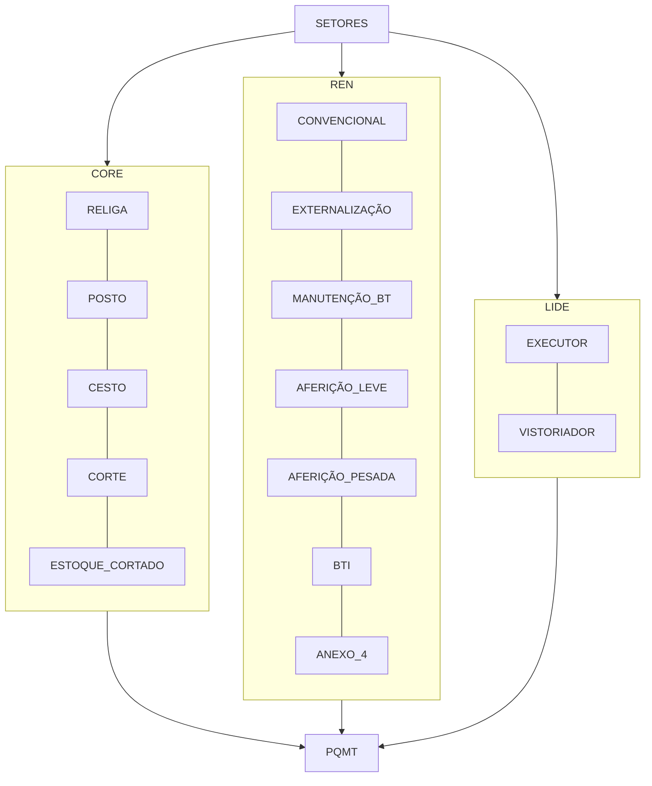

# Estrutura de setores e alavancas

```mermaid
graph TD;
subgraph CORE
  direction TB;
  RELIGA --- POSTO
  POSTO --- CESTO
  CESTO --- CORTE
  CORTE --- ESTOQUE_CORTADO
end

subgraph REN
  direction TB;
  CONVENCIONAL --- EXTERNALIZAÇÃO
  EXTERNALIZAÇÃO --- MANUTENÇÃO_BT
  MANUTENÇÃO_BT --- AFERIÇÃO_LEVE
  AFERIÇÃO_LEVE --- AFERIÇÃO_PESADA
  AFERIÇÃO_PESADA --- BTI
  BTI --- ANEXO_4
end

subgraph LIDE
  direction TB;
  EXECUTOR --- VISTORIADOR
end

SETORES --> CORE
SETORES --> REN
SETORES --> LIDE

CORE --> PQMT
REN --> PQMT
LIDE --> PQMT

```
